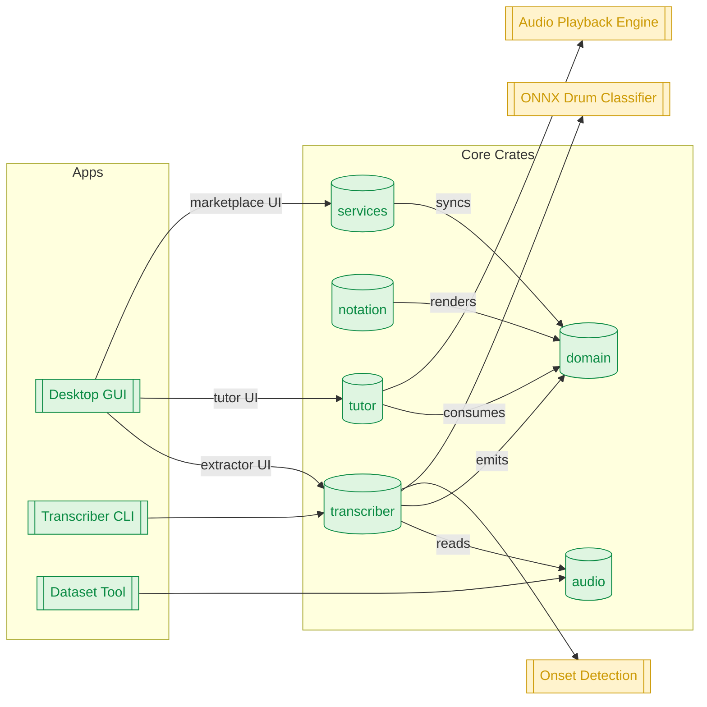

# Taal Architecture & Design Plan

## Technology Stack Decision
- **Language:** Rust is selected for the core implementation because it provides native-level performance, predictable memory management without a garbage collector, and excellent interoperability with audio/MIDI libraries.
- **UI Framework:** Use [`egui`](https://github.com/emilk/egui) with `wgpu` for a modern, GPU-accelerated desktop interface on Windows, macOS, and Linux. This stack enables rapid prototyping while maintaining native performance.
- **Audio/MIDI Backends:**
  - Windows: WASAPI/ASIO via `cpal` + optional ASIO bridge.
  - macOS: CoreAudio/CoreMIDI through `cpal` and `midir`.
  - Linux: ALSA/JACK using `cpal` + `jack` feature when available.
- **Data Storage:** SQLite for local persistence, orchestrated with `sqlx`. Cloud sync and marketplace services can be layered later using Supabase/Firebase.

## High-Level Modules
1. **Transcription Engine (`crates/transcriber`):**
   - Audio preprocessing (resampling, channel separation, normalization).
   - Onset detection, tempo estimation, beat tracking.
   - Drum hit classification leveraging ONNX runtime for neural networks (hi-hat openness, toms, snare cross-stick, etc.).
   - Quantization and MusicXML/MEI export.
2. **Notation & Editing (`crates/notation`):**
   - Drum staff rendering components reusable in both CLI and GUI contexts.
   - Symbol palette, grid snapping, tuplets, stickings, and dynamics editing.
3. **Tutoring Core (`crates/tutor`):**
   - MIDI ingestion, latency calibration, scoring algorithms, practice mode state machines.
   - Playback engine for backing tracks, click, and synthesized drum sounds.
4. **Desktop Application (`apps/desktop`):**
   - Main `egui` application hosting both extractor and tutoring workflows.
   - Project browser, lesson player, marketplace integration hooks.
5. **Shared Models (`crates/domain`):**
   - Common data structures (tempo map, drum events, lesson descriptors) shared across modules.
6. **Services & Marketplace (`crates/services`):**
   - Optional crate for networking, authentication, and content delivery.

## Component 1 – Drum Sheet Extractor
### Features
- Import WAV/MP3, analyze tempo, classify percussion instruments, quantize hits.
- Output formats: MusicXML, MIDI, JSON interchange.
- Built-in GUI workflow:
  1. File drop zone and waveform view.
  2. Visual hit timeline with instrument lanes.
  3. Editable drum staff with quantization controls, tuplets, and swing settings.
  4. Export panel with format selection and preview playback.
- Command-line utility wraps the same core logic for batch processing.

### Implementation Notes
- Use a dedicated async task runner (`tokio`) to offload heavy processing and keep the UI responsive.
- Persist extraction sessions in SQLite for quick reload and comparison.
- Provide hooks so extracted notation flows directly into the tutoring practice queue.

## Component 2 – Interactive Tutoring Environment
### Features
- MIDI connectivity wizard to map pads/zones and calibrate latency.
- Practice modes inspired by Melodics: Learn (step-through), Practice (loop and tempo ramping), Perform (full-speed scoring).
- Visualizers: animated kit view, scrolling note highway, and traditional notation overlay.
- Feedback analytics: timing deviations, velocity dynamics, sticking hints, and streak tracking.
- Integration with extracted charts: users can import a transcription, slow down tempo, loop difficult sections, and export their performance data.

### Implementation Notes
- Real-time loop runs on a dedicated audio thread; UI communicates via crossbeam channels.
- Scoring logic uses high-resolution timers and quantized expectation maps derived from notation.
- Bundle curated sample packs and allow routing to external VST hosts in later iterations.

## Marketplace & Future Extensions
- Start with local content packs authored by instructors.
- Extend services crate to sync lesson metadata and user progress to a cloud backend.
- Marketplace roadmap: submission workflow, moderation tools, ratings/reviews, and revenue sharing.

## Development Roadmap
1. **Milestone 0:** Repository scaffolding (Cargo workspace, CI, linting) and audio/MIDI research spikes.
2. **Milestone 1:** Prototype transcription engine with limited instrument set; CLI proof of concept.
3. **Milestone 2:** Build desktop extractor UI with waveform visualization and manual correction tools.
4. **Milestone 3:** Implement tutoring core with MIDI input, latency calibration, and simple practice mode.
5. **Milestone 4:** Integrate notation playback into tutoring UI, support lesson authoring.
6. **Milestone 5:** Add analytics, streak tracking, and cloud-ready persistence.
7. **Milestone 6:** Launch marketplace beta with community sharing features.

## Current Status Snapshot

The workspace is implemented and builds end‑to‑end. The following components are present with varying levels of completeness:

1. Domain models (tempo maps, drum events, lesson descriptors) — implemented with `serde` support.
2. Audio I/O (file decode via `symphonia`) — implemented; DSP/FFT scaffolding present.
3. Transcriber (tempo estimator + simple quantizer + CLI) — prototype logic in place.
4. Notation editor (`egui`) — simple event visualization; editor features TBD.
5. Tutor core (session state, scoring, MIDI enumeration) — basic flow and tests; MIDI input tested conditionally.
6. Services (marketplace client) — placeholder API surface; networking over `reqwest`+`rustls`.
7. Desktop app (extractor/tutor/marketplace tabs) — skeleton UI wired to core crates.

Implementation details recently updated:

- Networking uses `rustls` TLS to avoid OpenSSL system dependencies.
- Audio decode code adapted to current `symphonia` APIs.
- `time` crate `serde` feature enabled for serializing durations in domain types.

## Visual Architecture

The diagram below shows the main components and data flows. Items marked [built] exist in this repo; items marked [TBD] are planned.

Text description: The Desktop app hosts three surfaces (Extractor, Tutor, Marketplace) wired to library crates. The Transcriber reads audio via the Audio crate, converts it into Domain events, which Notation renders and Tutor consumes for practice and scoring. Services provide optional networking. Onset detection, classification, and playback engines are planned modules.

## Next Steps
1. Replace prototype tempo/quantization with real onset detection + beat tracking.
2. Integrate ONNX runtime for instrument classification and add dataset features to `tools/dataset-pipeline`.
3. Expand notation editor with selection, tuplets, and export (MusicXML/MIDI).
4. Build playback engine and wire into Tutor for audition and metronome.
5. Implement Marketplace client API calls and persistence.
